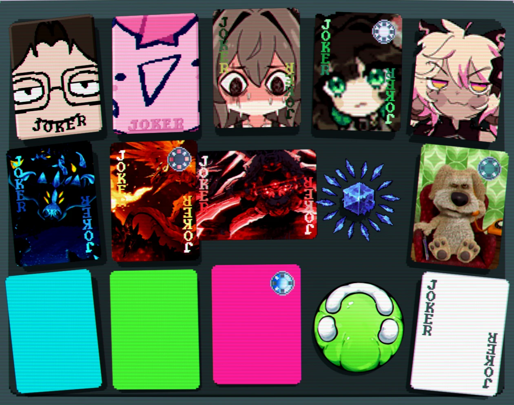
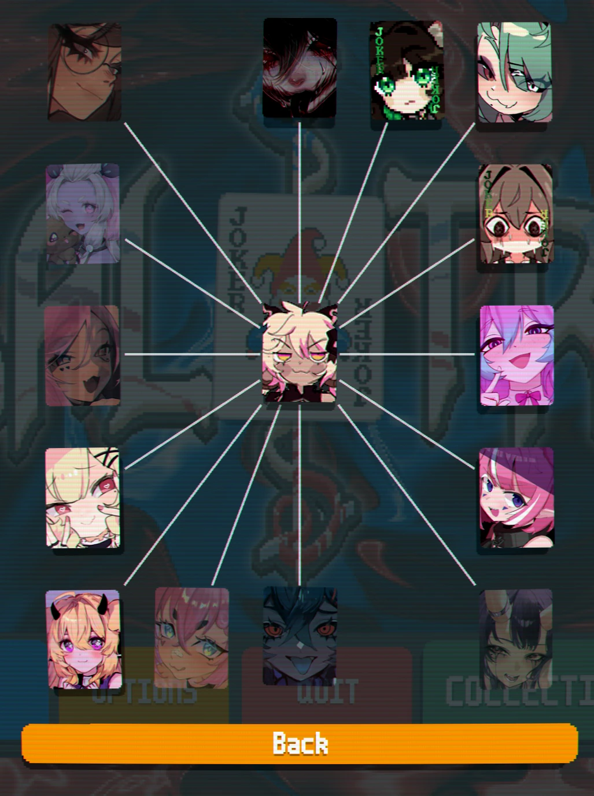
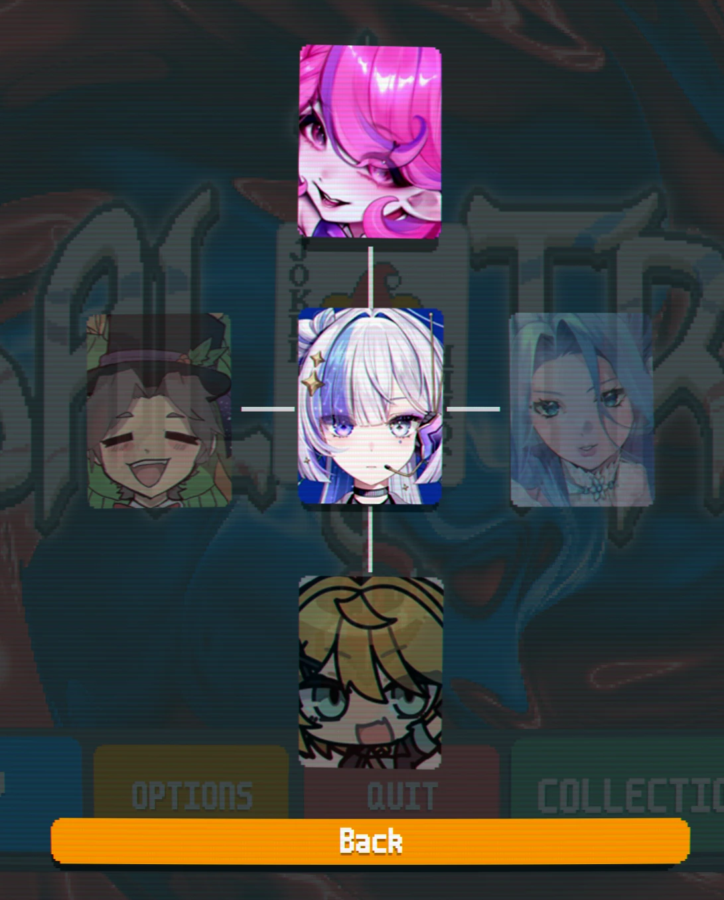
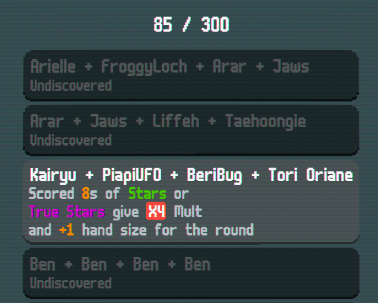
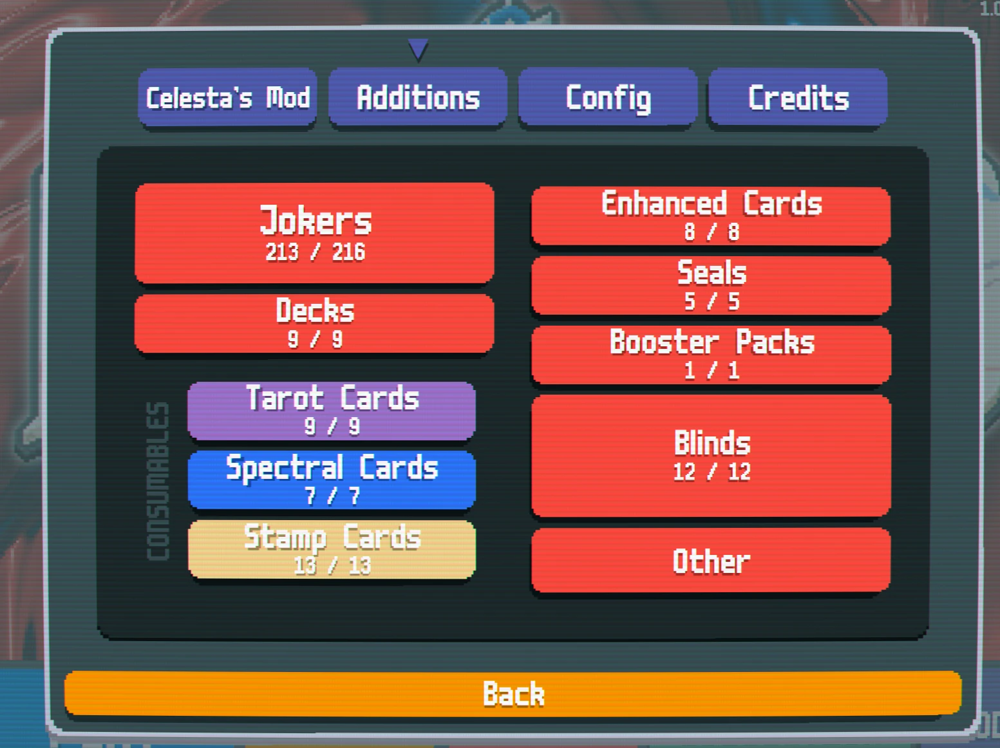

# Celesta's Mod

**No AI art or AI-generated assets are used in this mod.** Every piece of art
here was drawn by a person, and I do not support Gen-AI or AI art.

A large VTuber-themed content mod for [Balatro](https://www.playbalatro.com/),
built on [Steamodded](https://github.com/Steamodded/smods).

218 Jokers, and three Spectral cards that do things to them: **Bind** fuses two
Jokers into one, **Swap** trades the second Joker of two merged ones, and the
last turns a Joker into a harder, worse-tempered version of itself.

## Screenshots

The Collection. Every Joker is its own image.



Bind's web: pick a Joker and it shows everything it has a written combination
with, and what each one does.





The Special Merges tab keeps count. A combination stays hidden until you have
made it.



...and what the mod adds, in the Mods menu.



## What's in it

- **218 Jokers**: 60 Common, 80 Uncommon, 43 Rare, 13 Legendary, and 22 of a
  new rarity
- **Bind**, a Spectral that merges **2 selected Jokers into one** with the
  abilities of both, with **300 unique combinations**
- **Swap**, a Spectral that trades the **second Joker** of 2 merged ones
- **3 new suits**
- **9 new enhancements**
- **5 new seals**
- **10 new decks**
- **12 new Boss Blinds**
- **17 new consumables**, plus a new type of consumable with 13 cards and its
  own booster pack
- **19 challenges**

## Requirements

| | | |
|---|---|---|
| [Lovely Injector](https://github.com/ethangreen-dev/lovely-injector) | required | what lets any of this load at all |
| [Steamodded](https://github.com/Steamodded/smods) | required | 1.0.0 or newer |
| [Talisman](https://github.com/MathIsFun0/Talisman) | required | 2.7 or newer: several Jokers score `^Mult`, which is Talisman's |

Talisman is the only other **mod** you need. Lovely is an injector rather than a
mod, and Steamodded needs it whatever else you install.

## Installing

**1. Install Lovely Injector.**
Download the latest release for your platform from
[lovely-injector/releases](https://github.com/ethangreen-dev/lovely-injector/releases).
On Windows, drop `version.dll` next to `Balatro.exe`: find that folder with
Steam → right-click Balatro → **Manage** → **Browse local files**. On macOS,
follow the instructions in that repo's README; it uses a `.dylib` and a launch
script rather than a drop-in file.

**2. Find your Mods folder.** Create it if it isn't there.

| Windows | `%APPDATA%\Balatro\Mods` |
|---|---|
| macOS | `~/Library/Application Support/Balatro/Mods` |
| Linux (Proton) | `~/.steam/steam/steamapps/compatdata/2379780/pfx/drive_c/users/steamuser/AppData/Roaming/Balatro/Mods` |

**3. Install Steamodded.** Download the release ZIP from
[smods/releases](https://github.com/Steamodded/smods/releases) and unzip it into
the Mods folder, so you have `Mods/smods/` (or `Mods/smods-main/`: the folder
name doesn't matter, only that the folder contains the mod's files).

**4. Install Talisman.** Same again, from
[Talisman/releases](https://github.com/MathIsFun0/Talisman/releases), into
`Mods/Talisman/`.

**5. Install this mod.** On the [Releases](../../releases) page, download
`CelestasMod-1.0.0.zip` from under **Assets**, not "Source code (zip)", and
unzip it into the Mods folder. It contains a single `CelestasMod/` folder, so
you end up with `Mods/CelestasMod/`.

The source ZIP works too; it just unpacks to `celestas-mod-1.0.0/` instead.
Steamodded looks for the manifest rather than the folder name, so either is
fine.

**6. Launch Balatro.** There should be a **MODS** button on the main menu, with
Celesta's Mod listed. If a mod failed to load it says so there, with the error
attached: open that entry rather than guessing.

Your Mods folder should end up looking roughly like this:

```
Balatro/
+- Mods/
   +- smods/
   +- Talisman/
   +- CelestasMod/
```

## Performance

Some of this mod's scoring is long. Two things make a large difference and both
are worth doing before you start:

- Set **game speed** to the maximum in Balatro's own settings.
- If a hand still takes a very long time, turn on **Disable Scoring Animations**
  in Talisman's mod config (**Mods** → **Talisman** → **Config**).

The mod says the same thing in a notice on first launch, which can be turned
back on or off under **Mods** → **Celesta** → **Config**.

## Art and likenesses

**The code in this repository is MIT licensed. The artwork is not.**

Every Joker face was drawn by somebody else. Those images are here under the
informal terms fan works usually run on, they are not mine to relicense, and the
MIT grant in `LICENSE` does not extend to them. If you want to reuse something
from this repository, reuse the code; if you want the art, ask whoever drew it.

Credits live in the mod itself, under **Credits** in its config menu. Named
there:

- Calamitas: u/The_Overseer_Pal
- XM-05 Thanatos: Dezixus, on Pinterest
- Eidolon Wyrm: Nyrallia, on DeviantArt
- Astrum Aureus: Total Calamity Wiki
- Urschleim: Core Keeper wiki

The rest is VTuber art whose credits can usually be found through each person's
Twitter/BlueSky.

**If you drew something here and would like it credited differently or taken
out, open an issue and it will be removed.**

## Reporting a bug

Open an issue. The useful things to include:

- What you were doing: a hand played, a Joker bought, a merge made
- Which Jokers were in the row, especially any merged ones
- The log. Balatro writes it to `Mods/lovely/log/`; the newest file is the run
  that just crashed, and the last 50 lines are usually enough.

Merges are where the interesting bugs are. If a merged Joker is involved, saying
which two Jokers went into it is the single most useful detail.

## Building on it

Some files are **generated** and should not be hand-edited:

- `jokers/atlases.lua`: one atlas per image in `assets/1x/`
- `jokers/zz_vtubers.lua`: the placeholder roster, now empty
- `localization/en-us.lua`: every `j_celesta_*` Joker block is preserved
  verbatim from the existing file; everything else comes from the script

`python tools/gen_roster.py` rebuilds all three from `assets/`. It also masks
every card image to Balatro's corner silhouette on the way past, so art cannot
reach the game unshaped.

Other tools in `tools/`:

| | |
|---|---|
| `import_art.py <name> <1x> <2x>` | copies art in, refusing every way that has gone wrong before |
| `round_corners.py` | the corner mask on its own (`--check` to report only) |
| `check_atlases.py` | every atlas matches its image and every cell exists |
| `check_loc_keys.py` | every `localize` key resolves |
| `check_loc_vars.py` | every `#n#` in a description is supplied by `loc_vars` |
| `check_dependencies.py` | every foreign global is declared or guarded |
| `check_duplicate_art.py` | no image ships under two names |
| `check_runtime_globals.py` | no runtime use of `SMODS.current_mod` |

Both `merge/bind.lua` and `jokers/implemented.lua` sit at Lua's limit of **200
local variables per chunk**. Past it the whole file stops loading rather than
failing at a line, so new top-level helpers in either file go inside a
`do ... end` block.

The `prefix` in the manifest is `celesta`, and it is prepended to everything.

Localization keys use the full prefixed form, and so do cross-references
between the mod's own objects.

## License

MIT for the code: see [`LICENSE`](LICENSE). Not the art; see
[Art and likenesses](#art-and-likenesses) above.

## Links

- [Steamodded API wiki](https://github.com/Steamodded/smods/wiki)
- [`calculate` contexts](https://github.com/Steamodded/smods/wiki/calculate-functions)
- [Lovely Injector](https://github.com/ethangreen-dev/lovely-injector)
